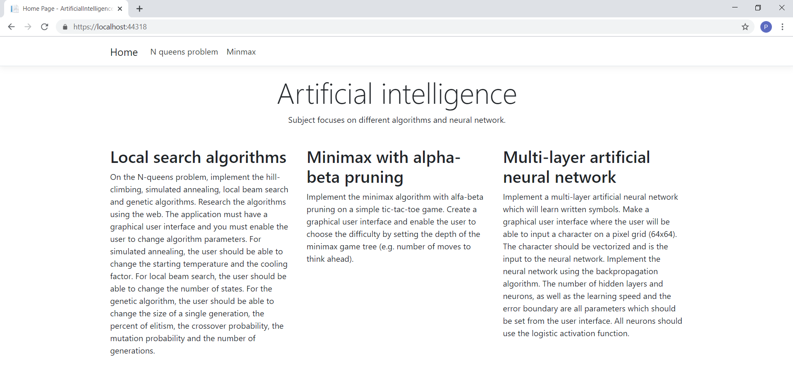
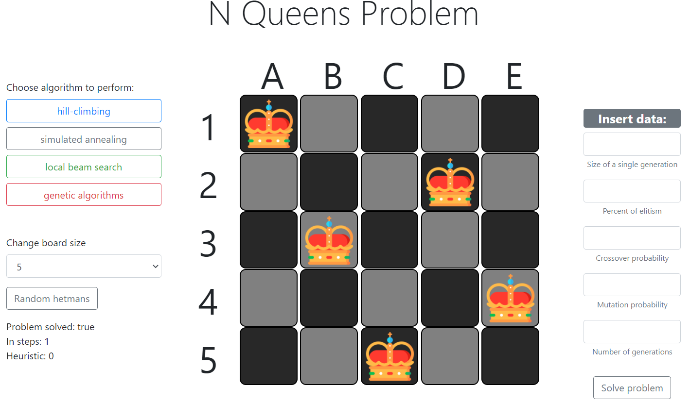
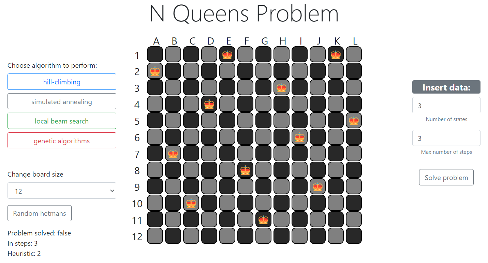
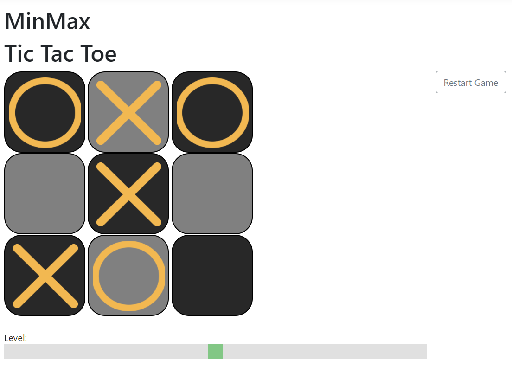

# IA in ASP.NET
Application solves N Queens Problem and Tick Tack Toe game using some AI techniques.  
In the future multi-layer artificial neural network will be implemented.

## Launching 
Web app needs to be run inVisual Studio with ASP.NET Core MVC tools.

## Navigation page
 

# N Queens Problem
The N Queen is the problem of placing N chess queens on an N×N chessboard so that no two queens attack each other.

App implements 4 different local search algorithms, each can be use with various of starting parameters. 
Size of board ca be between 4x4 to 12x12.

### Implemented algorithms:

* Hill Climbing Algorithm
* Simulated Annealing Algorithm
* Local Beam Search Algorithm
* Genetic Algorithm

## Hill Climbing Algorithm
 
#### Parameters:  
Maximum number of steps - default: 50

#### Algorithm:

        1. Move queen vertically in every column and count heuristic 
        2. Save queen on place where heuristic is the best.
        3. Move to next column and repeat 1, 2 steps untill all columns visited
           If board is blocked  -> generate new board
        4. Repeat steps 1, 2 and 3 until(steps = maximum number of steps) or(heuristic = 0)

## Simulated Annealing Algorithm

#### Parameters: 
Starting Temperature - default: 10 000 
Cooling Factor - default: 1

#### Algorithm:

           1.Move 1 queen randomly
           2. If heuristic result of state after move is worse or equal:
                 a) Calculate probability of acceptance:  e^(h/T)
            T = Temperature
            h = current heuristic result - new heuristic result
                  b) Generate random value from 0 to 1.
                  c) If value > probabiltyOfacceptance come back to input state
           4. Reduce Temperature by Cooling Factor
           5. If(heuristic == 0) or(Temperature< 0) finish and return solved board
           6. Repeat 1-6  

## Local Beam Search Algorithm

#### Parameters: 
Maximum number of steps - default: 50 
Number Of States - default: 20

#### Algorithm:

     1. Generate X random states and save them in states list.
     2. Find best state in list(the lowest heuristic result).
     3 .If best result == 0: return best state.
     4. Move queen vertically in every column and count heuristic
     5. Save queen on place where heuristic is the best.
     6. Move to next column and repeat 4, 5, 6 steps untill all columns visited
     7. If board is blocked  -> generate new board
     8. Reapet 4-8 untill every state in list visited
     9. Repeat steps 2-9 until(steps = maximum number of steps) or(heuristic = 0)

## Genetic Algorithm

#### Parameters: 
Size Of Single Generation - default: 100 
Percent Of Elitism - default: 20 
Crossover Probability - default: 35 
Mutation Probability - default: 5 
Number Of Generations - default: 1000

#### Algorithm:

     1. Create Generation List and NewGeneration List, Generate X random states for Generation
     2. If one of the state in generation list is solved: return solved state.
     3. Count heuristic for every state in Generation
     3. Sort Generation list
     4. (elitism) Save X first states into newGeneration.
     5. While newGeneration chromosomes count is smaller than SizeOfSingleGeneration repeat:
     a) (Selection Tournament) Randomly select 10 states from Generation list and return best one
     b) (Crossover) Randomly select a index from which place cut satets array: 
        childA = left side of ParentA array + right side of ParentB
        childB = left side of ParentB array + right side of ParentA
        add children to NewGeneration List
     c) (Mutation) Take 2 last elemnts of NewGeneration List and  mutete them -> Move random queen to random place on board.
     6. NewGeneration becomes Generation
     7. Repeat untill NumberOfGenerations is smaller then max numberOfGenerations

